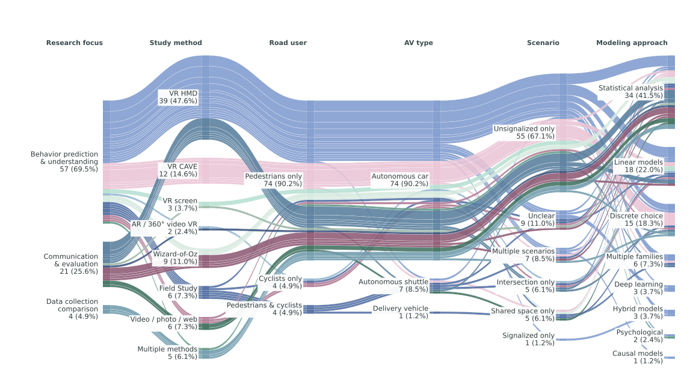

# Study combinations

This second plot covers the same 82 records and preserves the original category counts and ordering. It keeps the header-free and footer-free 16:9 layout.

The 14 colors encode **research focus × study method**. Each color stays the same through all six dimensions. The 52 ribbons represent observed full combinations, with matched incoming and outgoing positions at every node. A color can split into several ribbons when studies have different downstream classifications. The supplied blue (#809BCE), sky (#95B8D1), mint (#B8E0D2), pale mint (#D6EADF) and rose (#EAC4D5) palette supplies the base colors. Nine darker variations distinguish the remaining combinations. Colors do not encode effect size, quality or significance.

Open the SVG in a browser and hover over a ribbon to see its full classification and count. The color key below provides the complete mapping. All categories use neutral labels without thesis highlights. The source dataset covers 82 records, while the review describes 99 articles.

| Research focus | Study method | Color (hex) | Studies |
| --- | --- | --- | ---: |
| Behavior understanding & prediction | VR HMD | #809BCE | 29 |
| Behavior understanding & prediction | VR CAVE | #EAC4D5 | 12 |
| Behavior understanding & prediction | VR screen | #B8E0D2 | 2 |
| Behavior understanding & prediction | AR / 360° video VR | #95B8D1 | 1 |
| Behavior understanding & prediction | Wizard-of-Oz | #D6EADF | 3 |
| Behavior understanding & prediction | Field Study | #526FA3 | 6 |
| Behavior understanding & prediction | Video / photo / web survey | #B17C96 | 3 |
| Behavior understanding & prediction | Multiple methods | #629A88 | 1 |
| Communication design & behavior evaluation | VR HMD | #597F9D | 10 |
| Communication design & behavior evaluation | VR screen | #99B5A6 | 1 |
| Communication design & behavior evaluation | AR / 360° video VR | #3D557F | 1 |
| Communication design & behavior evaluation | Wizard-of-Oz | #8E5B75 | 6 |
| Communication design & behavior evaluation | Video / photo / web survey | #427261 | 3 |
| Data collection methods comparison | Multiple methods | #719CAD | 4 |

Rebuild with `MPLCONFIGDIR=/tmp/hvi-matplotlib python3 scripts/build_review_combinations.py`. Study IDs for every full path are in `data/review-combinations-summary.json`.
