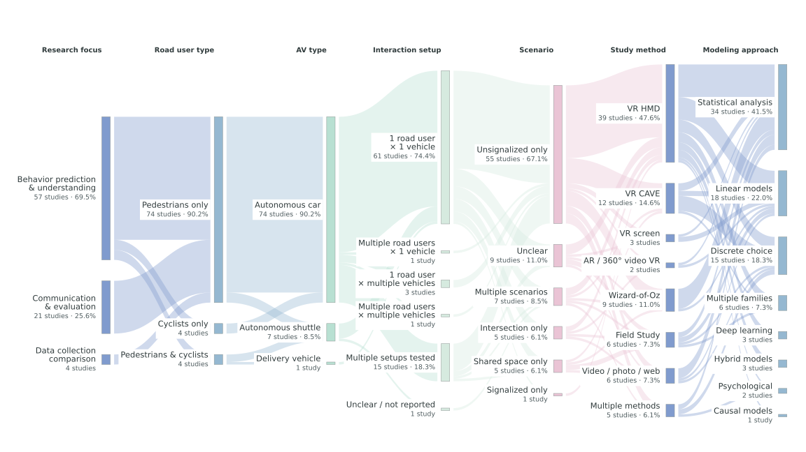

# Interaction setup in the review dataset

This figure covers 82 unique available records, not all 99 articles described in the review. Each column totals 82. It retains research focus and adds interaction setup, giving seven columns in a 16:9 layout.

The unhighlighted and [highlighted](../assets/img/review-interactions-highlighted.svg) versions show identical counts. The highlighted version retains the overview’s thesis categories and adds 1 road user × multiple vehicles (3 studies). Highlights identify independent categories, not an observed continuous study path.

## Counting rules

Study-level focal actor configurations, including explicitly described CG actors. Multiple setups tested means count configurations differ within a study. No inference of simultaneous human participation from plural words or road-user types.

A study comparing a pedestrian and a cyclist separately at 1:1 remains 1:1. Comparing an AV and an HDV separately at 1:1 also remains 1:1. Explicitly adding an HDV alongside an AV creates a different vehicle-count setup. Mixed traffic or presence of other users alone does not establish a number of simultaneous interacting actors. “Multiple setups tested” includes observational records with multiple configurations; it does not necessarily imply a controlled manipulation.

Computer-generated actors count as actors, but do not demonstrate multi-human experimentation. Agent annotations below retain this distinction; their absence means not specified in the database, not necessarily human-only. These classifications derive from the database descriptions, not a new full-paper review.

| Interaction setup | Studies | Percentage |
| --- | ---: | ---: |
| 1 road user × 1 vehicle | 61 | 74.4% |
| Multiple road users × 1 vehicle | 1 | 1.2% |
| 1 road user × multiple vehicles | 3 | 3.7% |
| Multiple road users × multiple vehicles | 1 | 1.2% |
| Multiple setups tested | 15 | 18.3% |
| Unclear / not reported | 1 | 1.2% |

## Study-level classification audit

| Study | Source description | Assigned setup | Notes |
| --- | --- | --- | --- |
| Currano et al. (2018) | 1 ped - 1 AV | 1 road user × 1 vehicle | All explicitly counted focal interactions are 1:1; changes in actor type alone do not create a different count setup.  |
| Rodríguez Palmeiro et al. (2018) | 1 ped-1 AV  /  1 ped-1 HDV | 1 road user × 1 vehicle | All explicitly counted focal interactions are 1:1; changes in actor type alone do not create a different count setup.  |
| Woodman et al. (2019) | 1 ped - 1 AV | 1 road user × 1 vehicle | All explicitly counted focal interactions are 1:1; changes in actor type alone do not create a different count setup.  |
| De Clercq et al. (2019) | 1 ped-1 AV | 1 road user × 1 vehicle | All explicitly counted focal interactions are 1:1; changes in actor type alone do not create a different count setup.  |
| Mahadevan et al. (2019) | multi peds-multi AVs  /  (CG agents) (mixed env) | Multiple road users × multiple vehicles | Explicit multi peds–multi AVs; includes CG agents. Explicit CG actors; not evidence of multiple human participants; Background traffic/users mentioned; use explicit focal counts only |
| Chung et al. (2020) | 1 ped - 1 AV | 1 road user × 1 vehicle | All explicitly counted focal interactions are 1:1; changes in actor type alone do not create a different count setup.  |
| Wang et al. (2020) | 1 ped - 1 AV | 1 road user × 1 vehicle | All explicitly counted focal interactions are 1:1; changes in actor type alone do not create a different count setup.  |
| Joisten et al. (2020) | 1 ped - 1 AV | 1 road user × 1 vehicle | All explicitly counted focal interactions are 1:1; changes in actor type alone do not create a different count setup.  |
| Dietrich et al. (2020) | 1 ped-1 AV | 1 road user × 1 vehicle | All explicitly counted focal interactions are 1:1; changes in actor type alone do not create a different count setup.  |
| Colley et al. (2022) | 1 ped - 1 AV | 1 road user × 1 vehicle | All explicitly counted focal interactions are 1:1; changes in actor type alone do not create a different count setup.  |
| Lee et al. (2022) | 1 ped-1 AV | 1 road user × 1 vehicle | All explicitly counted focal interactions are 1:1; changes in actor type alone do not create a different count setup.  |
| Andrijanto et al. (2022) | 1 ped-1 pod | 1 road user × 1 vehicle | All explicitly counted focal interactions are 1:1; changes in actor type alone do not create a different count setup.  |
| Tapiro et al. (2016) | 1 ped - 1 AV | 1 road user × 1 vehicle | All explicitly counted focal interactions are 1:1; changes in actor type alone do not create a different count setup.  |
| Holländer et al. (2019) | 1 ped-1 AV | 1 road user × 1 vehicle | All explicitly counted focal interactions are 1:1; changes in actor type alone do not create a different count setup.  |
| Nuñez Velasco et al. (2019) | 1 ped - 1 shuttle | 1 road user × 1 vehicle | All explicitly counted focal interactions are 1:1; changes in actor type alone do not create a different count setup.  |
| Ackermans et al. (2020) | 1 ped - 1 AV | 1 road user × 1 vehicle | All explicitly counted focal interactions are 1:1; changes in actor type alone do not create a different count setup.  |
| Li et al. (2020) | 1 ped - 1 AV, multi peds - 1 AV | Multiple setups tested | The description explicitly includes alternatives with different actor counts.  |
| Tapiro et al. (2020) | 1 ped - multi AV | 1 road user × multiple vehicles | Explicit 1 ped–multi AV.  |
| Razmi Rad et al. (2020) | 1 ped - 1 AV | 1 road user × 1 vehicle | All explicitly counted focal interactions are 1:1; changes in actor type alone do not create a different count setup.  |
| Bindschädel et al. (2021) | 1 ped - 1 AV | 1 road user × 1 vehicle | All explicitly counted focal interactions are 1:1; changes in actor type alone do not create a different count setup.  |
| Chen et al. (2020) | 1 ped - 1 AV  /  mixed environment | 1 road user × 1 vehicle | All explicitly counted focal interactions are 1:1; changes in actor type alone do not create a different count setup. Background traffic/users mentioned; use explicit focal counts only |
| Nuñez Velasco et al. (2021) | 1 ped - 1 AV | 1 road user × 1 vehicle | All explicitly counted focal interactions are 1:1; changes in actor type alone do not create a different count setup.  |
| Şahin et al. (2022) | 1 ped - 1 AV  /  1 ped - 1 HDV | 1 road user × 1 vehicle | All explicitly counted focal interactions are 1:1; changes in actor type alone do not create a different count setup.  |
| Wang et al. (2022) | 1 ped - 2 AVs | 1 road user × multiple vehicles | Explicit 1 ped–2 AVs.  |
| Tian et al. (2022) | 1 ped - 1 AV | 1 road user × 1 vehicle | All explicitly counted focal interactions are 1:1; changes in actor type alone do not create a different count setup.  |
| Tian et al. (2023) | 1 ped - 1 AV | 1 road user × 1 vehicle | All explicitly counted focal interactions are 1:1; changes in actor type alone do not create a different count setup.  |
| Zou et al. (2023) | 1 ped - 1 AV  /  1 ped - multi AVs | Multiple setups tested | The description explicitly includes alternatives with different actor counts.  |
| Figueroa-Medina et al. (2023) | 1 ped - 1 AV  /  1 ped - 2 AVs  /  (same direction) | Multiple setups tested | The description explicitly includes alternatives with different actor counts.  |
| Song et al. (2023) | 1 ped - 1 AV | 1 road user × 1 vehicle | All explicitly counted focal interactions are 1:1; changes in actor type alone do not create a different count setup.  |
| Watanabe et al. (2023) | 1 ped - 2 AVs | 1 road user × multiple vehicles | Explicit 1 ped–2 AVs.  |
| Sobhani and Farooq (2018) | 1 ped - 1 AV | 1 road user × 1 vehicle | All explicitly counted focal interactions are 1:1; changes in actor type alone do not create a different count setup.  |
| Jayaraman et al. (2020) | 1 ped - 1 AV | 1 road user × 1 vehicle | All explicitly counted focal interactions are 1:1; changes in actor type alone do not create a different count setup.  |
| Jayaraman et al. (2021) | 1 ped - 1 AV | 1 road user × 1 vehicle | All explicitly counted focal interactions are 1:1; changes in actor type alone do not create a different count setup.  |
| Kalatian and Farooq (2021) | 1 ped - 1 AV  /  1 ped - multi AVs | Multiple setups tested | The description explicitly includes alternatives with different actor counts.  |
| Kim et al. (2020) | 1 ped - 1 AV | 1 road user × 1 vehicle | All explicitly counted focal interactions are 1:1; changes in actor type alone do not create a different count setup.  |
| Kalatian and Farooq (2022) | 1 ped - 1 AV | 1 road user × 1 vehicle | All explicitly counted focal interactions are 1:1; changes in actor type alone do not create a different count setup.  |
| Shipman et al. (2022) | 1 ped - 1 AV | 1 road user × 1 vehicle | All explicitly counted focal interactions are 1:1; changes in actor type alone do not create a different count setup.  |
| Pekkanen et al. (2022) | 1 ped - 1 AV | 1 road user × 1 vehicle | All explicitly counted focal interactions are 1:1; changes in actor type alone do not create a different count setup.  |
| Giles et al. (2019) | 1 ped - 1 AV | 1 road user × 1 vehicle | All explicitly counted focal interactions are 1:1; changes in actor type alone do not create a different count setup.  |
| Shen et al. (2015) | 1 ped - 1 AV | 1 road user × 1 vehicle | All explicitly counted focal interactions are 1:1; changes in actor type alone do not create a different count setup.  |
| Kwon et al. (2022) | 1 ped - 1 AV | 1 road user × 1 vehicle | All explicitly counted focal interactions are 1:1; changes in actor type alone do not create a different count setup.  |
| Jiang et al. (2016) | 1 ped - 1 AV  /  2 peds - 1 AV  /  (both CG and human) | Multiple setups tested | The description explicitly includes alternatives with different actor counts. Explicit CG actors; not evidence of multiple human participants; Explicit human co-actor annotation |
| Jiang et al. (2018) | 1 ped - 1 AV  /  2 peds - 1 AV  /  (human) | Multiple setups tested | The description explicitly includes alternatives with different actor counts. Explicit human co-actor annotation |
| Jiang et al. (2019) | 1 ped - 1 AV  /  2 peds - 1 AV  /  (both CG and human) | Multiple setups tested | The description explicitly includes alternatives with different actor counts. Explicit CG actors; not evidence of multiple human participants; Explicit human co-actor annotation |
| O’Neal et al. (2019) | 1 ped - 1 AV  /  2 peds - 1 AV  /  (human) | Multiple setups tested | The description explicitly includes alternatives with different actor counts. Explicit human co-actor annotation |
| Joisten et al. (2021) | 1 ped - 1 AV  /  3 peds - 1 AV  /  (2 CG non-crossers) | Multiple setups tested | The description explicitly includes alternatives with different actor counts. Explicit CG actors; not evidence of multiple human participants |
| Jiang et al. (2021) | 1 ped - 1 AV  /  2 peds - 1 AV  /  (box or humanoid CG) | Multiple setups tested | The description explicitly includes alternatives with different actor counts. Explicit CG actors; not evidence of multiple human participants |
| Lanzer et al. (2023) | 1 ped - 2 AVs  /  4 peds - AVs  /  (CG crossers) | Multiple setups tested | The description explicitly includes alternatives with different actor counts. Explicit CG actors; not evidence of multiple human participants; Second condition says 4 peds–AVs without a precise vehicle count; alternative road-user counts establish multiple setups |
| Feng et al. (2023) | 1 ped - 1 AV  /  2 peds - 1 AV  /  (human) | Multiple setups tested | The description explicitly includes alternatives with different actor counts. Explicit human co-actor annotation |
| Hagenzieker et al. (2020) | 1 cyc - 1 AV | 1 road user × 1 vehicle | All explicitly counted focal interactions are 1:1; changes in actor type alone do not create a different count setup.  |
| Vlakveld et al. (2020) | 1 cyc - 1 AV  /  1 cyc - 1 AV (eHMI)  /  1 cyc - 1 HDV | 1 road user × 1 vehicle | All explicitly counted focal interactions are 1:1; changes in actor type alone do not create a different count setup.  |
| Oskina et al. (2023) | 1 cyc - 1 AV | 1 road user × 1 vehicle | All explicitly counted focal interactions are 1:1; changes in actor type alone do not create a different count setup.  |
| Nuñez Velasco et al. (2021) | 1 cyc - 1 AV  /  1 cyc - 1 HDV | 1 road user × 1 vehicle | All explicitly counted focal interactions are 1:1; changes in actor type alone do not create a different count setup.  |
| Beauchamp et al. (2022) | 1 ped - 1 pod  /  1 cyc - 1 pod  /  1 driver - 1 pod | 1 road user × 1 vehicle | All explicitly counted focal interactions are 1:1; changes in actor type alone do not create a different count setup.  |
| Gehrke et al. (2023) | 1 ped - 1 delivery vehicle  /  1 cyc - 1 delivery vehicle | 1 road user × 1 vehicle | All explicitly counted focal interactions are 1:1; changes in actor type alone do not create a different count setup.  |
| Madigan et al. (2019) | 1 ped - 1 shuttle,  /  1 cyc - 1 shuttle  /  (presence of other users) | 1 road user × 1 vehicle | All explicitly counted focal interactions are 1:1; changes in actor type alone do not create a different count setup. Background traffic/users mentioned; use explicit focal counts only |
| De Ceunynck et al. (2022) | pedestrians,  /  cyclists,  /  e-scooters -  /  automated shuttles | Unclear / not reported | User and vehicle types are listed without counts; plurals do not establish simultaneous multiplicity.  |
| Mallaro et al. (2017) | 1 ped-1 AV | 1 road user × 1 vehicle | All explicitly counted focal interactions are 1:1; changes in actor type alone do not create a different count setup.  |
| Pala et al. (2021) | 1 ped-1 AV | 1 road user × 1 vehicle | All explicitly counted focal interactions are 1:1; changes in actor type alone do not create a different count setup.  |
| Maruhn et al. (2020) | 1 ped-1 AV | 1 road user × 1 vehicle | All explicitly counted focal interactions are 1:1; changes in actor type alone do not create a different count setup.  |
| Fuest et al. (2020) | 1 ped-1 AV | 1 road user × 1 vehicle | All explicitly counted focal interactions are 1:1; changes in actor type alone do not create a different count setup.  |
| Habibovic et al. (2018) | 1 ped-1 AV | 1 road user × 1 vehicle | All explicitly counted focal interactions are 1:1; changes in actor type alone do not create a different count setup.  |
| Deb et al. (2018) | 1 ped-1 AV | 1 road user × 1 vehicle | All explicitly counted focal interactions are 1:1; changes in actor type alone do not create a different count setup.  |
| Moore et al. (2019) | 1 ped-1 AV | 1 road user × 1 vehicle | All explicitly counted focal interactions are 1:1; changes in actor type alone do not create a different count setup.  |
| Deb et al. (2020) | 1 ped-1 AV | 1 road user × 1 vehicle | All explicitly counted focal interactions are 1:1; changes in actor type alone do not create a different count setup.  |
| Dey et al. (2020) | 1 ped - 1 AV | 1 road user × 1 vehicle | All explicitly counted focal interactions are 1:1; changes in actor type alone do not create a different count setup.  |
| Métayer and Coeugnet (2021) | 1 ped-1 AV | 1 road user × 1 vehicle | All explicitly counted focal interactions are 1:1; changes in actor type alone do not create a different count setup.  |
| Lau et al. (2021) | 1 ped-1 automated bus | 1 road user × 1 vehicle | All explicitly counted focal interactions are 1:1; changes in actor type alone do not create a different count setup.  |
| Wang et al. (2021) | 1 ped-1 AV | 1 road user × 1 vehicle | All explicitly counted focal interactions are 1:1; changes in actor type alone do not create a different count setup.  |
| Wilbrink et al. (2021) | 1 ped-1 AV  /  multi peds-1 AV (1 CG agent) | Multiple setups tested | The description explicitly includes alternatives with different actor counts. Explicit CG actors; not evidence of multiple human participants |
| Soshiroda et al. (2021) | 1 ped-1 automated bus  /  1 ped-1 automated golf cart | 1 road user × 1 vehicle | All explicitly counted focal interactions are 1:1; changes in actor type alone do not create a different count setup.  |
| Furuya et al. (2021) | 1 ped - 1 AV | 1 road user × 1 vehicle | All explicitly counted focal interactions are 1:1; changes in actor type alone do not create a different count setup.  |
| Faas et al. (2021) | 1 ped-1 AV | 1 road user × 1 vehicle | All explicitly counted focal interactions are 1:1; changes in actor type alone do not create a different count setup.  |
| Dey et al. (2021) | 2 peds-1 AV  /  (1 CG agent) | Multiple road users × 1 vehicle | Explicit 2 peds–1 AV, with one CG agent. Explicit CG actors; not evidence of multiple human participants |
| Chang et al. (2022) | 1 ped-1 AV | 1 road user × 1 vehicle | All explicitly counted focal interactions are 1:1; changes in actor type alone do not create a different count setup.  |
| Schmitt et al. (2022) | 1 ped - 1 AV | 1 road user × 1 vehicle | All explicitly counted focal interactions are 1:1; changes in actor type alone do not create a different count setup.  |
| Bindschädel et al. (2022) | 1 ped-1 AV | 1 road user × 1 vehicle | All explicitly counted focal interactions are 1:1; changes in actor type alone do not create a different count setup.  |
| Bindschädel et al. (2022) | 1 ped - 1 AV | 1 road user × 1 vehicle | All explicitly counted focal interactions are 1:1; changes in actor type alone do not create a different count setup.  |
| Hübner et al. (2022) | 1 ped-1 AV  /  1 ped-1 AV-1 HDV mixed env | Multiple setups tested | The description explicitly includes alternatives with different actor counts. Background traffic/users mentioned; use explicit focal counts only |
| Bindschädel et al. (2023) | 1 ped-1 AV | 1 road user × 1 vehicle | All explicitly counted focal interactions are 1:1; changes in actor type alone do not create a different count setup.  |
| Kang et al. (2023) | 1 ped-1 AV | 1 road user × 1 vehicle | All explicitly counted focal interactions are 1:1; changes in actor type alone do not create a different count setup.  |
| Colley et al. (2023) | 1 ped-multi AVs  /  multi peds-multi AVs  /  (2 CG agents)  /  mixed env | Multiple setups tested | The description explicitly includes alternatives with different actor counts. Explicit CG actors; not evidence of multiple human participants; Background traffic/users mentioned; use explicit focal counts only |

Run `MPLCONFIGDIR=/tmp/hvi-matplotlib python3 scripts/build_review_interactions.py` to rebuild. Full study IDs and link membership appear in `data/review-interactions-summary.json`.
