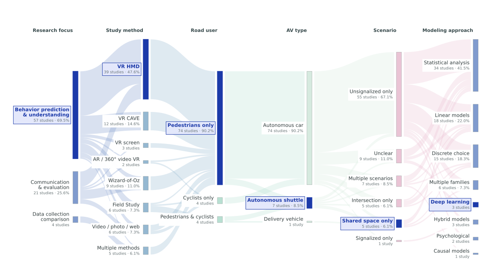

# Review dataset overview

Source: `data/studies.js`. **82 unique study records, 2015–2023.**

The website describes 99 articles; this export covers only the 82 unique records in the local dataset.

## How to read the figure

One study per Sankey stage; multiple study methods, scenario tags and model families form explicit exclusive groups. Raw tag statistics overlap and count each study once per tag. Links are adjacent-stage cross-tabulations, not causal or temporal transitions.

The method stage keeps VR HMD, VR CAVE, VR screen, Wizard-of-Oz and field studies separate. Single-method online video, photo and web surveys are grouped; single-method AR and 360° video VR studies are grouped. Any study listing multiple methods goes only into ‘Multiple methods’. The scenario stage retains single tags and groups records with multiple tags, without imposing a primary scenario. Autonomous-system groups map directly from av_type: AV/car, Shuttle/pod (displayed as Autonomous shuttle) and Delivery vehicle. The study-method column places VR HMD, VR CAVE, VR screen and the combined AR / 360° video VR group together. One deep-plum accent independently highlights Behavior prediction & understanding, VR HMD, Pedestrians only, Autonomous shuttle, Shared space only and Deep learning as thesis-related categories. These highlights do not imply a shared subset of studies. No record matches all six highlighted categories: all three studies in the exclusive Deep learning group use Autonomous car, not Autonomous shuttle. Therefore the figure does not draw a continuous highlighted ribbon. Background-flow opacity is 0.30, approximately 62% lower than 0.78. Labels keep full counts, while percentages are omitted for groups below five studies. All percentages remain available in this report. Modeling methods use distinct model_family values within each study: one family retains its label, multiple families go into ‘Multiple model families’. ‘Hybrid models’ is an existing dataset family and is not synonymous with multiple families. The report’s overlapping model-family statistics include those multi-family studies, so they can exceed the exclusive Sankey node counts. The figure uses a 16:9 slide layout. Short labels refer to the same audit categories: Statistical analysis = statistical tests / description; Multiple families = multiple model families; Video / photo / web = survey methods. Complete categories and percentages remain in the tables below.

These are descriptive coverage statistics, not pooled effect sizes or tests of statistical significance. The dataset does not provide harmonized effect estimates for a quantitative synthesis. Sample descriptions mix participants, trials and decisions, so they are not summed.

## Research focus

| Category | Studies | % of 82 |
| --- | ---: | ---: |
| Human Behavior Understanding and Prediction | 57 | 69.5% |
| Communication Design + Behavior Evaluation | 21 | 25.6% |
| Data Collection Methods Comparison | 4 | 4.9% |

## Study method (overlapping)

| Category | Studies | % of 82 |
| --- | ---: | ---: |
| VR HMD | 43 | 52.4% |
| VR CAVE | 15 | 18.3% |
| Wizard-of-Oz | 11 | 13.4% |
| Field Study | 6 | 7.3% |
| Online Video Survey | 5 | 6.1% |
| VR screen | 3 | 3.7% |
| Photo Survey | 1 | 1.2% |
| 360 Video VR | 1 | 1.2% |
| AR HMD | 1 | 1.2% |
| AR | 1 | 1.2% |
| Web Survey | 1 | 1.2% |

## Road-user group

| Category | Studies | % of 82 |
| --- | ---: | ---: |
| Pedestrians only | 74 | 90.2% |
| Cyclists only | 4 | 4.9% |
| Pedestrians & cyclists | 4 | 4.9% |

## Scenario tag (overlapping)

| Category | Studies | % of 82 |
| --- | ---: | ---: |
| unsignalized | 62 | 75.6% |
| intersection | 10 | 12.2% |
| shared | 9 | 11.0% |
| unclear | 9 | 11.0% |
| signalized | 1 | 1.2% |

## Model family (overlapping)

| Category | Studies | % of 82 |
| --- | ---: | ---: |
| statistics | 37 | 45.1% |
| linear | 22 | 26.8% |
| discrete-choice | 21 | 25.6% |
| hybrid | 3 | 3.7% |
| deep-learning | 3 | 3.7% |
| psychological | 2 | 2.4% |
| causal | 1 | 1.2% |

## Autonomous-system group

| Category | Studies | % of 82 |
| --- | ---: | ---: |
| Autonomous car | 74 | 90.2% |
| Autonomous shuttle | 7 | 8.5% |
| Delivery vehicle | 1 | 1.2% |

## Modeling methods (exclusive groups)

| Category | Studies | % of 82 |
| --- | ---: | ---: |
| Statistical tests / description | 34 | 41.5% |
| Linear models | 18 | 22.0% |
| Discrete-choice models | 15 | 18.3% |
| Multiple model families | 6 | 7.3% |
| Hybrid models | 3 | 3.7% |
| Deep learning | 3 | 3.7% |
| Psychological models | 2 | 2.4% |
| Causal models | 1 | 1.2% |

## Publication year

| Category | Studies | % of 82 |
| --- | ---: | ---: |
| 2020 | 17 | 20.7% |
| 2022 | 17 | 20.7% |
| 2021 | 16 | 19.5% |
| 2023 | 12 | 14.6% |
| 2019 | 10 | 12.2% |
| 2018 | 6 | 7.3% |
| 2016 | 2 | 2.4% |
| 2015 | 1 | 1.2% |
| 2017 | 1 | 1.2% |

## Reproduce and audit

Run `MPLCONFIGDIR=/tmp/hvi-matplotlib python3 scripts/build_review_overview.py` (requires matplotlib).
The generator checks unique IDs, stage totals and flow conservation. `data/review-overview-summary.json` contains category statistics, every link’s contributing study IDs, and each study’s six-stage path.
